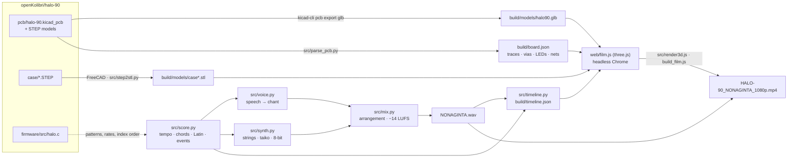
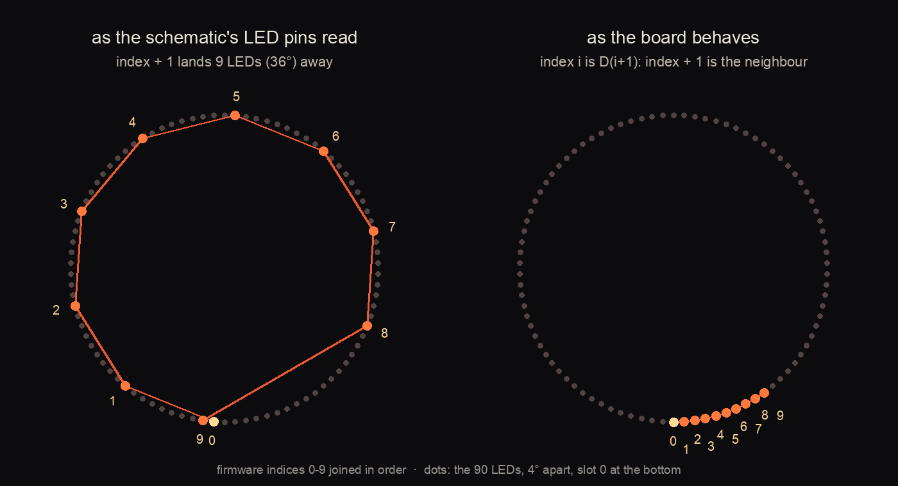
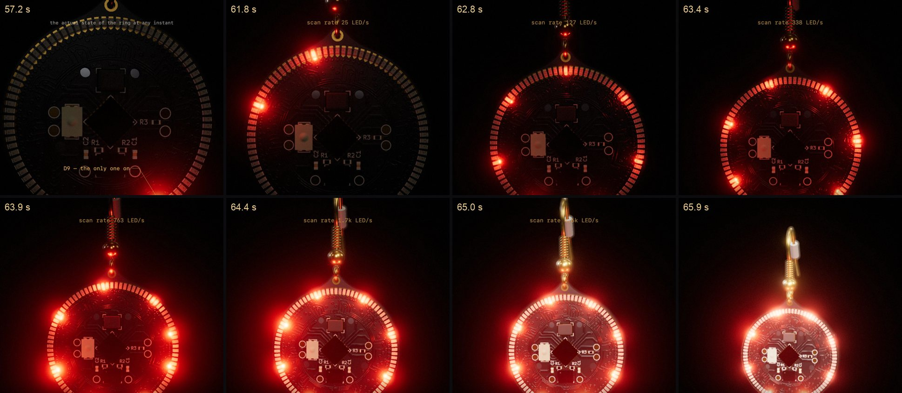
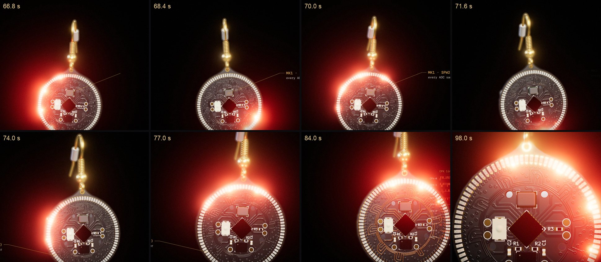

# NONAGINTA — technical notes

How the film is made, how faithful each part is to the real HALO-90, and how to rebuild or re-time it.
The overview, with pictures, is in the [README](../README.md).

## Pipeline



## Sources

- **3D models.** `kicad-cli pcb export glb` on `pcb/halo-90.kicad_pcb`, with every part's STEP model from the
  HALO-90 repo: the 0402 LEDs, STM8L151, SPW2430 mic, button, BAT-HLD-001 and the `frenchEarwire.stp` earwire
  (H1). The GLB keeps KiCad's reference designators (D1–D90, U1, MK1, S1, BT1, H1), so every part can be
  animated or called out by name.
- **Case.** Tessellated from `case/caseBot.STEP` and `caseTop.STEP` with FreeCAD (`src/step2stl.py`), with
  Ø5 × 3 mm magnets in their pockets.
- **CR2032.** Modelled to spec (Ø20 × 3.2 mm), with the + face engraved, seated in the holder; one spare sits
  under each earring in the case.
- **Board data.** `src/parse_pcb.py` reads every copper segment, via, pad and net and each LED's position,
  anode/cathode nets and firmware index into `build/board.json`.

## Materials

- **Copper under the soldermask.** Every KiCad segment is baked into 2048² colour, roughness/metalness and
  bump maps on planar UVs over the mask meshes (`bakeCopper` in `web/rig.js`). Copper under black mask shows
  as slightly lifted, glossier lines. Vias are tented: a raised ring with a shallow dimple. The bump strength
  is scaled with the output width, so a 480p preview has the same relief as 1080p.
- **Marble case.** White Carrara on both halves: a procedural object-space shader (simplex fBm, gently warped
  sine veins with a soft haze, sparse hairlines), injected with `onBeforeCompile`, with a different seed per
  half.
- **Metals.** ENIG pads, gold-plated earwire, steel cells and magnets.

## LEDs

Each of the 90 LEDs is its own emissive mesh. Levels are indexed by physical slot: 4° apart, slot 0 at the
bottom.

### Index order

`ledHigh(led)` drives `CPX[led / 9]` high and a second pin low. Read literally against the schematic's LED
A/K pins, firmware index + 1 lands 9 LEDs (36°) away. The real board clusters, as the firmware's own
"angle/4" comment intends. That happens exactly when each LED sits the other way round, making index i = D(i+1)
for all 90. The film uses that mapping (`firmware_map()` in `src/parse_pcb.py`). If a board ever scatters in
audio mode, swap the high/low pins in `ledHigh()`; if it clusters, the schematic's LED pins are the ones
reversed.



### Duty cycle and perception

Only one LED is ever on. Each frame shows each LED's share of the eye's last 50 ms (its duty cycle),
perceived as duty^0.3. `film.js` then scales the ring by 1/√(total/6), so an evenly scanned ring and a single
LED keep the same relative brightness as the rest of the film. The ring lights the board through eight
point lights, one per 45° sector, each at its sector's brightness-weighted centre with its total brightness.
That keeps the board lighting steady when the ring is nearly even. With the whole ring lit (the release
pulse at 0:01.7, the downbeat flash at 0:30), each light leaves a small glint on the ENIG pads beneath it,
a faint eight-spoke pattern. It is kept; the real board shows much the same.

### The patterns

| mode | firmware | in the film |
|---|---|---|
| boot | `setLed(debounce / 200)` while the button is held | one revolution in about a second, in the prologue and again inside the closed case at the end |
| Halo | `setLed((prevLed + 13) % 90)` on the RTC wake-up | 13 and 90 are coprime, so all 90 are visited once per cycle and every LED gets the same share. Early on, one step per sung syllable, drawn as arcs over the components. |
| Halo, refrain | same | one step per beat until "omnes", then an exponential ramp to the device's own rate: RTC wake-up every (2 + 1) / (38 kHz LSI / 2) ≈ 158 µs, i.e. **6.3 kHz**. There each LED lights 70 times a second, past flicker fusion, and the ring fades over a second into the even 1/90 glow. |
| audio | `setLed((4140 + rotationCenter + adc) % 90)` on every ADC conversion | the soundtrack through a mic model at ADC rate (see below). `rotationCenter++` every 40 ms (TIM2: 16 MHz / 2⁷ / 5000), so the cluster circles the ring once every 3.6 s. |
| sparkle | `rand() % 15 ? ledLow(prevLed) : setLed(rand() % 90)` | brief random flashes |



### Audio mode

`adc_duty()` in `src/timeline.py` runs the mixed soundtrack through an SPW2430-like MEMS mic: a 100 Hz
high-pass, 45 ADC counts at full scale (about 88 dB SPL for typical passages at −42 dBV/Pa and
0.73 mV/count), and 0.6 counts of ADC noise, at the audio sample rate. It then stores, per frame, how long
each offset from `rotationCenter` was lit over the eye's 50 ms, as a 90-byte histogram in
`build/timeline.json` (`adc`). Quiet passages make a tight cluster; loud ones spread it to about ±25 LEDs.
The CPX-line trace in the overlay and the glowing nets on the board follow the same ADC-driven LED and the
pins the firmware drives for it.



## Earwire

- **On the ear.** It hangs from an unseen ear as a damped double pendulum (ear → hook → loop → board), pushed
  by the drum hits. The pendulum is simulated for the whole film up front, so every frame is deterministic
  (`web/pendulum.js`).
- **In the case.** Always the original, unbent STEP geometry. It is swivelled 90° about the PCB hole's axis, so
  the loop stays threaded while the loop and coil lie level along the wall, and the silicone stopper fades
  out on the way in.
- **Tail.** The unbent tail would run down through the slot floor and out under the base, so the earwire's
  material is clipped at the base's underside.

## Case

Placed by eye, with no physics simulation. The left pocket already holds a spare cell and the second earring.
Then the second spare cell goes into the right pocket, the hero is laid on it, and the lid comes down;
the magnets seat it on "Amen".

## Camera and timing

- **One continuous camera.** A time-aware cubic Hermite spline through keys with explicit up vectors, C¹ at
  every key (`web/shots.js`). `src/qa_continuity.py` flags any frame-to-frame change that isn't on a beat.
  `src/qa_los.js` raycasts from the camera to the lit LED in the opening shots, to check it is never
  hidden behind a part.
- **Timing.** The film reads only `build/timeline.json`: sections, lines, syllables, marks, beats, bars,
  per-frame audio features and the audio-mode histograms. The camera path and every effect are placed in
  musical positions, so another soundtrack plus its cue sheet re-times the whole film.
- **Hex field.** The panel in APERTVM grows into an infinite field of HALO-90 impostors (a top-down render of
  the hero board), one ring of the hexagonal lattice per beat, faster and faster, until it fills the frame on
  the D-major blaze.

## Rebuild

```sh
git clone --recurse-submodules git@github.com:openKolibri/halo90-chant.git && cd halo90-chant
# or, in an existing clone: git submodule update --init   (vendor/halo-90 = openKolibri/halo-90, pinned)
python3 -m venv .venv && .venv/bin/pip install -r requirements.txt
npm install
python3 src/parse_pcb.py vendor/halo-90/pcb/halo-90.kicad_pcb build/board.json
src/export_models.sh                                    # KiCad GLB + case STEP -> STL
.venv/bin/python src/mix.py                             # soundtrack (~5 min first run)
.venv/bin/python src/timeline.py --write-cue cues/nonaginta.cue
.venv/bin/python src/timeline.py --cue cues/nonaginta.cue --audio build/audio/nonaginta.wav --score
RES=480 SEGDIR=build/seg480 node src/build_film.js out/HALO-90_NONAGINTA_480p.mp4   # quick preview
RES=1080 node src/build_film.js out/HALO-90_NONAGINTA_1080p.mp4                    # ~19 min on an M3
.venv/bin/python src/qa_continuity.py out/HALO-90_NONAGINTA_1080p.mp4             # flags unexplained jumps
python3 src/extras.py                                                              # subtitles + lyric sheet
.venv/bin/python src/doc_figures.py out/HALO-90_NONAGINTA_1080p.mp4               # the images in docs/img
```

It needs:
- macOS (the `say` voices), KiCad 8+ (`kicad-cli`), FreeCAD, Google Chrome and ffmpeg;
- Node ≥ 18 and Python ≥ 3.11.

One Chrome worker is fastest on Apple silicon, because several contend for the GPU.

**Memory guard.** Chrome needs about 2 GB at 1080p.
- `src/render3d.js` won't start with less than 25% of memory free (`sysctl kern.memorystatus_level`), and it
  kills Chrome if free memory drops below 15% (`START_FREE_PCT` / `MIN_FREE_PCT`).
- `build_film.js` renders in 150-frame chunks and restarts Chrome every 1,200 frames.
- With `RESUME=1` it keeps finished chunks. After an interruption or a local fix, delete only the affected
  `build/seg3d/c*.mp4` chunks and run it again.
- `SEGDIR` gives previews their own chunk folder, so they don't wipe the 1080p chunks.

**Tools**

- One frame: `RES=480 node src/render3d.js --still 93 still.jpg`
- Many views in one Chrome session:
  `node src/evals.js dir 'name=window.debugCase(161.2, {pos: [..], at: [..], walls: false})' …`
  This gives fixed cameras with no depth of field or type, and can hide the case walls or lid.
- Variants of one frame: `node src/ab_test.js 160.2 dir 'a=' 'b=<js>'`
- Boot and memory check: `RES=1080 node src/boot_test.js 40`
- Contact sheets: `.venv/bin/python src/contact_sheet.py out.jpg files… --cols 3`
- Model inspection: open `web/inspect.html` through `node src/serve.js`.

**Another soundtrack (e.g. Suno).**
1. See `out/SUNO.md`, then fill in `cues/suno_template.cue`.
2. Run `src/timeline.py --cue … --audio … [--vocals stem.wav]` without `--score`.

Beats, bars and hits are then detected from the audio, and syllables are aligned on the sixteenth-note grid.

## Files

`vendor/halo-90` is a git submodule of [openKolibri/halo-90](https://github.com/openKolibri/halo-90), pinned to the
commit the film was built from; `src/parse_pcb.py`, `src/export_models.sh` and `src/doc_figures.py` read from it.

| path | role |
|---|---|
| `src/score.py` | tempo, chords, lyrics, melodies, firmware-derived event streams |
| `src/voice.py` · `src/synth.py` · `src/mix.py` | speech-to-chant, orchestra, arrangement and master |
| `src/timeline.py` | audio + cue sheet → `build/timeline.json` (score-exact or detected), incl. the audio-mode histograms |
| `src/parse_pcb.py` · `src/export_models.sh` · `src/step2stl.py` | KiCad/STEP → board data and 3D models |
| `web/film.js` | the film: scene, case choreography, lights, per-frame update, QA hooks |
| `web/rig.js` | GLB/STL loading, materials (copper bake, marble), CR2032, case |
| `web/shots.js` | the single camera path and every lighting and effect envelope |
| `web/leds.js` | the LED patterns as the device runs them |
| `web/fx.js` · `web/overlay.js` · `web/pendulum.js` · `web/earwire.js` | arcs and hex field, typography, earwire physics, earwire parts |
| `src/render3d.js` · `src/build_film.js` | headless-Chrome frame capture (memory-guarded), chunked render, mux |
| `src/qa_continuity.py` · `src/qa_los.js` · `src/evals.js` · `src/ab_test.js` · `src/boot_test.js` | QA |
| `src/doc_figures.py` · `src/contact_sheet.py` | the images in `docs/img` |
| `out/LYRICS.md` · `out/HALO-90_NONAGINTA.srt` · `out/SUNO.md` | lyric sheet, subtitles, Suno prompt |
| `legacy/` | the first, 2D version of the film |
